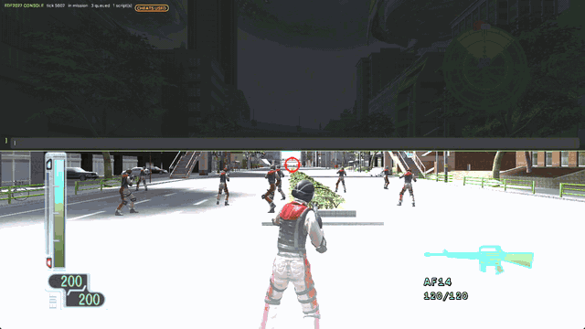
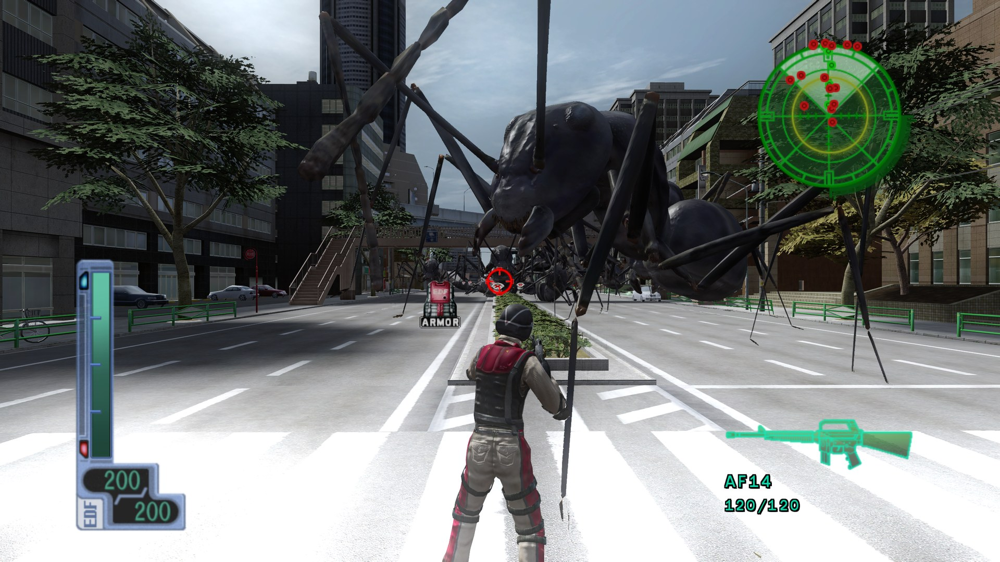
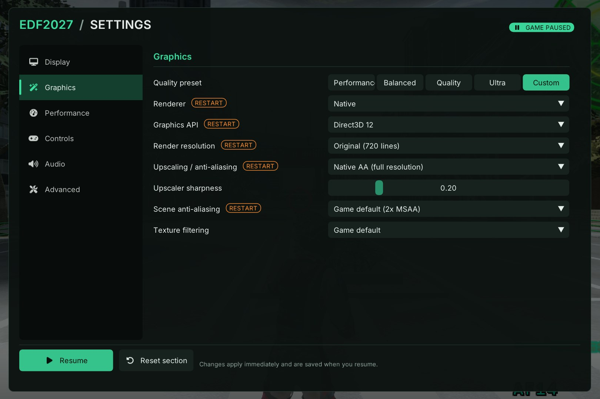
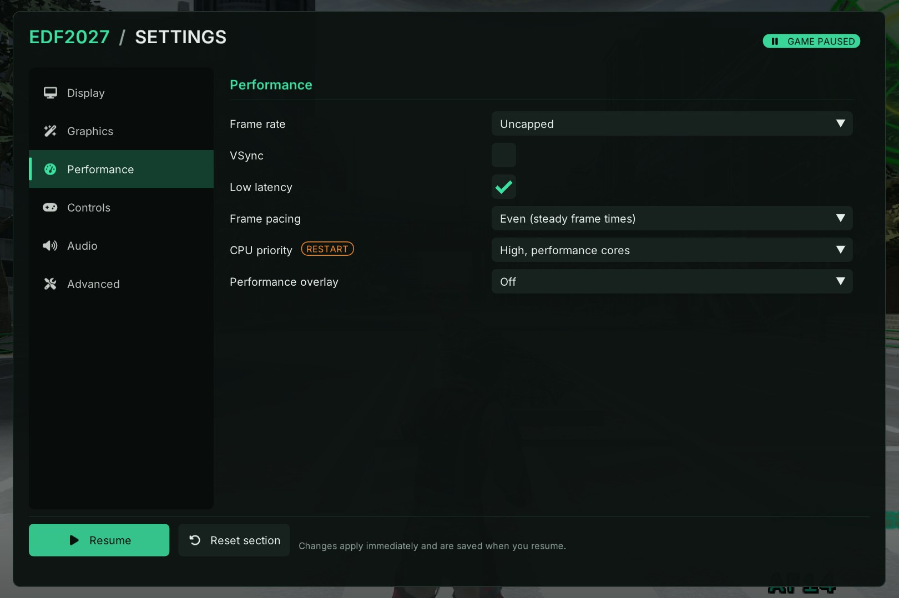
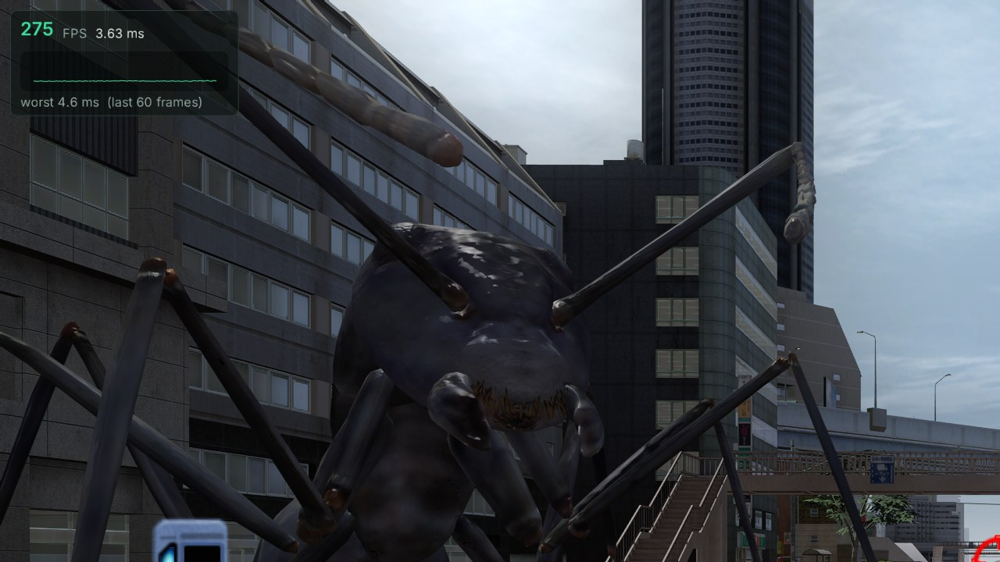
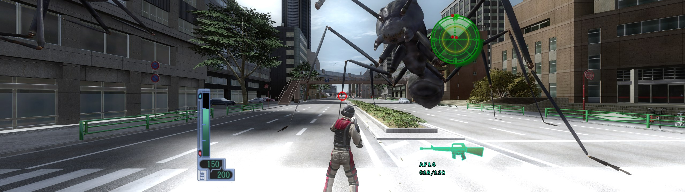
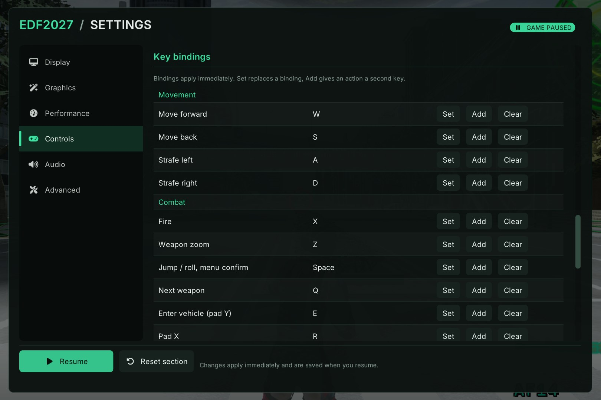

# EDF2027: EDF 3 recompilation from the 360 version (v0.3.0-beta)



*The in-game console (`` ` ``) spawning 1,000 ants in Mission 1.*

A native Windows port of the Xbox 360 game *Earth Defense Force 2017*
(USA/Europe), made by static recompilation with the
[ReXGlue](https://github.com/rexglue/rexglue-sdk) SDK. The game's PowerPC code
is translated to C++ ahead of time and runs natively. The port's own Direct3D 12
renderer draws the frame.



*Mission 1, rendered at 2560x1440 with FSR Native AA on the native Direct3D 12
renderer (shown here at 1920x1080).*

**This package contains no game data.** You need your own copy of the game
(the Xbox 360 disc dumped as an `.iso`, title id `445007D3`).

The dump this port is developed against:

| | |
|---|---|
| Size | 7,835,492,352 bytes |
| SHA-1 | `3F5DADC9BD11399E3EF260018A058F420EAFB1F6` |

Other dumps of the same release should work, because the setup screen checks
the title id in `default.xex` and not the image hash. This is the one that has
been tested, though. Check yours with `Get-FileHash -Algorithm SHA1 <file>.iso`
on Windows or `sha1sum <file>.iso` elsewhere.

## Features

- **Native Direct3D 12 renderer.** It draws the whole 3D frame from the scene
  the game publishes, in this order: sky, models, static world, effects,
  transparent, post-processing, then the game's own HUD. The original
  renderer is still available as *Classic*, and Direct3D 11 is available as a
  fallback.
- **High frame rates.** The simulation stays at 60 Hz, as in the original, and
  the renderer draws extra frames in between with interpolated camera and
  model poses. The choices are 60 (locked, the default), 120, 144, 165, 240 or
  uncapped. A precise frame limiter holds the cap. Uncapped, Mission 1 combat
  runs at about 200 to 300 FPS on the development machine (Intel Core
  i7-14700, GeForce RTX 4070 Ti SUPER), depending on the scene and the
  settings.
- **Faster recompiled game code.** The port's own build of the ReXGlue code
  generator keeps the PowerPC registers in C++ locals instead of a shared
  context structure. One 60 Hz simulation step takes about 25% less time in
  Mission 1 and about 18% less with 1,000 ants on the map, with the same
  results as the stock translation. The locked 60 FPS mode now holds a true
  60 (it used to settle at about 57).
- **In-game console.** Spawn enemies (hundreds at a time), bring buildings
  down, set off effects, toggle cheats and run scripts
  ([docs/console.md](docs/console.md)).
- **Low input latency.** Low-latency presentation is on by default. With VSync
  on and the frame rate uncapped, the median input-to-photon time went from
  42 ms to 18 ms.
- **AMD FSR 3.1 anti-aliasing** at native resolution (*Native AA*).
- **Any resolution and aspect ratio**, 4K and 21:9 or 32:9 ultrawide included.
  Wider screens see more at the sides (Hor+). The HUD and menus stay in a
  16:9 safe area.
- **Pause menu (F1)** with settings that apply live. It pauses the game and
  can be driven with a controller.
- **Controllers and keyboard and mouse.** SDL3 or XInput controllers, per-player
  button remapping, dead zones, and native keyboard and mouse with rebindable
  keys.
- **Optional manual reload**, off by default.
- **Quick loading.** The Mission 1 loading screens take about 3-4 seconds
  each on the development machine.
- **Built-in disc extraction.** Point the setup screen at your `.iso`.

## Requirements

- Windows 10 or 11, 64-bit.
- A GPU with Direct3D 12 (feature level 11_0 or newer).
- A 64-bit CPU with AVX2 and FMA: Intel Haswell (4th-generation Core, 2013),
  AMD Zen (Ryzen, 2017) or newer. On an older CPU the release build shows
  "This build requires a CPU with AVX2/FMA" and exits. See
  [older CPUs](#older-cpus) to build one that runs there.
- About 6 GB of free disk space for the extracted game.
- Your own dump of the game (see above).

The port is Windows only. CMake refuses to configure the game on other systems,
because the renderer needs Direct3D 12.

## Quick start

1. Unzip the release anywhere and run `edf2027.exe`. Keep the DLLs next to it.
   The game does not start without `rexruntime.dll` and
   `amd_fidelityfx_dx12.dll`. The Visual C++ runtime DLLs are included, so no
   separate redistributable is needed.
2. On first run the setup screen appears. Click **Select disc image (.iso)…**
   and pick your dump. The game is extracted (about 6 GB) into your user
   folder, with a progress bar. If you already have the disc extracted (a
   folder containing `default.xex`), use **Select extracted game folder…**
   instead.
3. The game boots straight into the title screen. Press **Start** twice (Enter
   on the keyboard). The first press skips the intro. On the first run of a new
   version, a small "Preparing shaders" panel in the bottom-right corner counts
   the game's shaders as they compile in the background (about a second on a
   desktop CPU). The game does not wait for it, and later runs skip it.
4. Press **F1** at any time for the settings.

The config file is `%APPDATA%\edf2027\edf2027.toml`, and the extracted game is
in `%APPDATA%\edf2027\game\`. Delete the config file to run setup again.

## Settings (F1)



**F1** in game, or **Back + Start** on a controller (configurable), opens the
settings menu. While it is open the game is paused: the simulation, the game
clock and (by default) the sound stop, the mouse is freed, and neither the
keyboard, the mouse nor the pad reach the game. Resume with the Resume button,
Esc, F1, B or Start.

- Sections: Display, Graphics, Performance, Controls (with the key-binding
  table), Audio and Advanced.
- Most settings apply immediately. The ones the game reads at startup carry a
  **RESTART** badge, and the bottom bar offers *Restart now*.
- Display-mode and window-size changes revert after 10 seconds unless you keep
  them.
- Graphics has Performance, Balanced, Quality and Ultra presets. Every section
  can be reset to its defaults.
- Settings are saved when you resume.
- With a controller, LB and RB switch sections, A selects and B goes back.

Other keys:

- **F2** shows or hides the performance overlay: frame rate, a frame-time
  graph, and CPU and GPU time. Its level of detail is set in F1 >
  Performance.
- **F4** opens the advanced ReXGlue settings (every runtime option).
- **`** opens the EDF2027 console: spawn enemies, collapse buildings, set off
  explosions, read performance numbers, change any setting, and run command scripts
  (see [docs/console.md](docs/console.md)). The console's game commands are cheats and
  mark the run as such.
- **F3** opens the debug overlay, and **F9** the ReXGlue log console.
- `edf2027.exe --settings` opens the settings before the game boots.

### Frame rate and latency

*Performance > Frame rate* offers 60 (locked, the original), 120, 144, 165, 240
or Uncapped. The game always simulates at 60 Hz. Above 60, the extra frames
are drawn in between and motion is smoothed, which adds up to one simulation
tick (16.7 ms) of delay. This needs Direct3D 12 and is still marked
experimental. Menus stay at about 60 FPS. The details are in
[framerate-unlock.md](docs/framerate-unlock.md).





*The performance overlay (F2), uncapped at 2560x1440 with FSR Native AA.
This is a crop of the top-left corner.*

- **VSync** (`edf_native_vsync`, on by default) waits for the display's
  refresh. With VSync on, the display's refresh rate is the ceiling. With it
  off, frames go out as soon as they are ready, and a G-Sync or FreeSync
  display stays smooth.
- **Low latency** (`edf_low_latency`, on by default) shows the newest frame as
  late as the display allows. With VSync on, it keeps the game at most one
  frame ahead of the display. Measured with VSync on, uncapped, aiming with the
  mouse: the median input-to-photon time went from 42 ms to 18 ms, and the
  99th percentile went from 52 ms to 29 ms. With VSync on and a frame rate
  above the display's, it can cost frame rate when the GPU is the limit. With
  VSync off, only the mouse part applies (aim takes the newest motion): the
  presentation part would cost about 5% of uncapped frame rate for no gain.
- **Frame pacing** sets how a cap is held with VSync off: *Even* for steady
  frame times, or *Low latency*.
- **CPU priority** keeps the game's two busiest threads on the performance
  cores of hybrid Intel CPUs (the default).

### Graphics

- **Renderer.** *Native* (`edf_native_renderer=native`, the default) is the
  port's own full-frame renderer. It is faster, and FSR needs it. *Classic*
  (`off`) replays the game's original draw calls, for comparison or if Native
  shows a problem.
- **Graphics API.** Direct3D 12 is the default. *Direct3D 11 (fallback)* runs
  the Classic renderer at 60 FPS only.
- **Upscaling / anti-aliasing.** *Native AA* runs AMD FSR 3.1 as temporal
  anti-aliasing at full resolution (`edf_native_fsr=native_aa`), with an
  adjustable sharpness. The Quality, Balanced, Performance and Ultra
  performance choices currently also run as Native AA, because render scaling
  is not implemented yet. Turning FSR on needs a restart, because it switches
  the scene to single-sampled rendering. FSR is loaded from
  `amd_fidelityfx_dx12.dll` in the game's folder. The release ships AMD's
  signed build of that DLL.
- **Scene anti-aliasing.** The game's default 2x MSAA, off, 2x or 4x.
- **Texture filtering.** The game's default, or anisotropic filtering from 1x
  to 16x.

### Resolution and aspect ratio



*A 32:9 window, rendered at 5120x1440. The view is wider at the sides, and
the HUD stays in the centred 16:9 area.*

Any window size or fullscreen resolution works, and the game renders in the
window's shape by default:

- **Aspect ratio** (`edf_aspect`). *Fill window* shows more at the sides on
  screens wider than 16:9 (21:9, 32:9) and more above and below on narrower
  ones (16:10, 4:3). The other choices are *Ultrawide* (pure Hor+),
  *Letterbox* (16:9 with bars) and *Stretch*.
- **HUD and menus** (`edf_hud_safe_area`). *16:9* keeps the HUD, menus, text
  and videos in the centred 16:9 area at their own shape. *Full* stretches
  them over the whole screen.
- **Render resolution.** The size the game is drawn at. The default is
  *Match window*: the window's own size (`--edf_native_render_height=-1`).
  The other choices use the window's shape: *Original (720 lines)*, the
  game's own 1280x720 on a 16:9 screen (`--edf_native_render_height=0`), then
  900, 1080, 1440, 1800 or 2160 lines. You can also set a fixed custom size
  from 640x480 up to 8192 on either axis (16.7 million pixels at most, for
  example 5120x2880). The image is then scaled to the window, so a size above
  the window's is supersampled. This setting needs a restart. On a slow GPU
  with a large screen, a lower setting such as 1080 lines is faster.
- **Scaling filter** (`edf_present_filter`). *Auto* keeps whole-pixel
  placement, scales exactly at whole factors and area-filters when the render
  is larger than the window. *Bilinear* is the original single bilinear
  sample.

## Controls

Any gamepad that SDL3 recognizes (Xbox, PlayStation, Switch Pro and others)
works out of the box, and `gamecontrollerdb.txt` adds community mappings.
XInput (Xbox-compatible pads, up to four) is the alternative: set *Controls >
Controller API* in F1, or pass `--input_backend=xinput`. The change takes
effect after a restart.

Both APIs support:

- hot-plugging (the first pad connected is player 1, the next player 2);
- vibration;
- navigating the F1 menu with the pad;
- per-stick dead zones and a trigger threshold;
- a per-player button remap (*Controls > Controller mapping*): swap or clear
  buttons and triggers, swap the sticks, invert axes. It is saved as
  `edf_pad_remap_p1` and `edf_pad_remap_p2`.

The pad chord that opens F1 always uses the physical buttons.

Keyboard and mouse are native, not an emulated gamepad. Keys go straight into
the game's own input channels. The mouse is added to the soldier's aim as an
angle, so it has no stick dead zone, no turn-rate cap and no acceleration. A
gamepad keeps working alongside. Keyboard and mouse are on by default
(*Keyboard and mouse* in F1). They use the game's **Technical** control type,
which is selected for player 1.

| Key | Action | Key | Action |
|---|---|---|---|
| W A S D | Move | Mouse | Aim |
| Left mouse / X | Fire | Right mouse / Z | Weapon zoom |
| Space | Jump / roll, confirm in menus | Middle mouse / Q | Next weapon |
| E | Enter vehicle (pad Y) | Backspace | Cancel in menus (pad B) |
| Arrows | Menu navigation (d-pad) | R | Pad X |
| Enter | Start: title screen, pause | Tab | Back: retire |
| F / C | Stick press (L3 / R3) | G | Reload (optional, see below) |

- Mouse sensitivity 1.0 turns 0.05° per mouse count. A zoomed weapon divides
  that by its magnification, as the game does for the stick. The in-game stick
  sensitivity does not affect the mouse. *Invert vertical aim* is in F1.
- In vehicles, the mouse falls back to driving the right stick as a rate,
  because how each vehicle turns that stick into aim has not been worked out
  yet.
- Menus are keyboard-driven. There is no mouse pointer in them.
- Fire, zoom, jump and next weapon follow the in-game controller settings. If
  you move *Fire* to another pad button there, the Fire key moves with it.



Everything above can be rebound in F1 under **Controls > Key bindings**:

- *Set* replaces a binding, and *Add* gives an action a second key.
- Each mouse button can be pointed at any action.
- Bindings apply immediately and are written to the config file when you
  resume.
- A binding needs the modifiers it names and ignores the others. So `W` still
  moves while Shift is held, and `Shift+W` needs Shift.
- Binding a key that another action already uses flags both rows, since only
  one of them would respond in game.

The same settings can be edited as raw `kbm_*` cvars in the F4 overlay.
`--edf_kbm=false` turns native keyboard and mouse off.

**Manual reload (optional, not in the original game).** EDF 2017 only reloads
when a magazine runs dry. *Controls > Gameplay additions > Manual reload*
(`edf_manual_reload`, off by default, applies at once) adds a Reload key and a
controller button:

- The key is **G**, and it can be rebound under Key bindings.
- The button is whatever you map under *Controller mapping > Extra actions >
  Reload*. Otherwise it is a click of the right stick
  (`edf_manual_reload_pad`), which the game itself leaves unused.
- A press starts the current weapon's reload exactly as an empty magazine
  would: the full reload time and gauge, then a full magazine. The rounds that
  were left are replaced.
- It does nothing with a full magazine, mid-reload or mid-burst, in a vehicle,
  for weapons that never reload or that refill at once (grenades), or while
  C-bombs or sentry guns are deployed.
- When it is off, the key and the button do nothing, and every button reaches
  the game as before.

Press **Escape** at any time outside the F1 menu to quit the game. It cannot
be rebound.

## Command line (optional)

```
edf2027.exe [--game_data_root=<folder>] [--settings] [--fullscreen=true|false]
            [--window_width=N --window_height=N]
            [--edf_native_unlock_framerate=true --edf_fps_cap=N]
            [--edf_native_vsync=true|false] [--edf_low_latency=true|false]
            [--edf_native_fsr=off|native_aa] [--edf_aspect=native|ultrawide|letterbox|stretch]
            [--edf_hud_safe_area=16:9|full] [--edf_native_render_height=-1]
            [--edf_native_render_width=W --edf_native_render_height=H] [--edf_show_fps=true|false]
            [--edf_native_renderer=native|off] [--audio_mute=true|false] [--log_file=run.log]
```

- Write config options on the command line as `--name=value`. Boolean options
  also accept `--name` (true) or `--no-name` (false).
- Do not write `--name false`: the separate word does not turn the flag off.
- Passing the same option twice does not mean the last one wins, so pass
  each option once.
- `--edf_fps_cap=0` with the frame rate unlocked is uncapped.
- `--edf_native_scene_backend=d3d11 --edf_native_backend=d3d11` selects the
  Direct3D 11 fallback.

The renderer's diagnostic switches are described in
[docs/renderer-internals.md](docs/renderer-internals.md).

## Troubleshooting

- *"That disc image is not Earth Defense Force 2017"*: the title id in
  `default.xex` did not match `445007D3`. Only the USA/Europe release is
  supported.
- *"This build requires a CPU with AVX2/FMA"*: the release build is compiled
  for x86-64-v3 (AVX2, FMA, BMI1/2, LZCNT, MOVBE, F16C). See
  [older CPUs](#older-cpus).
- **A black window or a GPU error.** Check the log for native shader, draw or
  presentation failures. Try *Graphics > Renderer > Classic*
  (`--edf_native_renderer=off`), and then the Direct3D 11 fallback. Installing
  a Xenos GPU plugin does not help, because this port no longer uses one.
- **FSR has no effect.** It needs the Native renderer on Direct3D 12, and a
  restart after it is turned on. When FSR stays off, the log says why (search
  it for `FSR`).
- **The game does not start and names a missing DLL.** `rexruntime.dll` and
  `amd_fidelityfx_dx12.dll` must be next to `edf2027.exe`, together with the
  bundled Visual C++ runtime DLLs (`msvcp140*.dll`, `vcruntime140*.dll`).
- **Logs and crash dumps.** Every run writes a log to `logs\` next to the
  executable (or `%APPDATA%\edf2027\logs` when that folder is read-only); the
  newest 10 runs are kept. A crash also writes a `.dmp` and a summary there and
  names them in a message box. Attach both to a bug report.

## Building from source

The build is Windows-only and uses clang, not MSVC's `cl`. The recompiled
game is 81 large generated C++ translation units (about 84 MB of source
under `generated/default/`), so a build needs a lot of memory and time.

### Prerequisites

| Tool | Version used | Notes |
|---|---|---|
| Visual Studio 2026 (version 18) Community | MSVC 14.50 toolset | Workload *Desktop development with C++*, with a Windows 10/11 SDK and the *C++ Clang Compiler for Windows* component. `build.cmd` and `validate-renderer-offline.cmd` expect `C:\Program Files\Microsoft Visual Studio\18\Community`. |
| clang / clang++ and lld-link | 20.1.8 | The copy that ships with Visual Studio (`VC\Tools\Llvm\x64\bin`) is the one used. The presets call `clang` and `clang++` from `PATH`. |
| CMake | 3.25 or newer (4.x used) | Visual Studio's bundled CMake works. |
| Ninja | 1.12 | Visual Studio's bundled Ninja works. |
| Python | 3.x | Configuring with tests on (the default) needs it, and so do the tools under `tools/`. |
| ReXGlue SDK | 0.10.0 | `find_package(rexglue 0.10.0)`. See below. |
| Git | any | |

**The ReXGlue SDK.** Build and install
[rexglue-sdk](https://github.com/rexglue/rexglue-sdk) at the `v0.10.0` tag,
with FidelityFX turned on (`REXGLUE_ENABLE_FIDELITYFX`, which is off by
default). Run these commands from a Visual Studio x64 developer prompt, in a
folder of your choice (`C:\rex` here):

```cmd
cd C:\rex
git clone --recursive --branch v0.10.0 https://github.com/rexglue/rexglue-sdk.git
cd rexglue-sdk
cmake --preset win-amd64 -DREXGLUE_ENABLE_FIDELITYFX=ON -DCMAKE_INSTALL_PREFIX=C:\rex\sdk_ffx\win-amd64
cmake --build --preset win-amd64-release
cmake --install out\build\win-amd64 --config Release
```

The rest of this section calls `C:\rex\sdk_ffx\win-amd64` "the SDK". It
contains `lib\cmake\rexglue`.

- **The signed FidelityFX DLL.** The FSR path wants AMD's signed
  `amd_fidelityfx_dx12.dll`, the one that includes frame generation, from the
  FidelityFX SDK's `PrebuiltSignedDLL` folder. The SDK build fetches it into
  `rexglue-sdk\out\build\win-amd64\_deps\fidelityfx-src\PrebuiltSignedDLL\`.
- CMake looks for the DLL at `<SDK>\..\..\rexglue-sdk\out\...`. With the
  layout above (`C:\rex\rexglue-sdk` next to `C:\rex\sdk_ffx`), that is where
  it is. If your layout is different, pass
  `-DEDF2027_FFX_SIGNED_DLL_PATH=<path to amd_fidelityfx_dx12.dll>`.
- If CMake does not find the signed DLL, it stages the SDK's own build of the
  DLL instead. That build has the upscaler and no frame generation, and the
  configure log says so.
- `-DEDF2027_FFX_SIGNED_DLL=OFF` always uses the SDK's DLL.
- Either way the DLL is copied next to `edf2027.exe` and into the package.

### Configure and build

`build.cmd` does both steps inside the Visual Studio developer environment:

```cmd
set REXGLUE_SDK=C:\path\to\sdk\win-amd64
set BUILD_JOBS=2
build.cmd                                   & rem win-amd64-release, target edf2027
build.cmd win-amd64-relwithdebinfo edf2027  & rem preset, target
```

- `REXGLUE_SDK` is the SDK's `win-amd64` folder. It defaults to the
  maintainer's local path, so set it.
- `BUILD_JOBS` is the number of parallel compiler jobs, 2 by default. Clang
  needs a lot of memory for each generated file, and it runs out of memory at
  high parallelism. Raise the number only if you have plenty of free RAM. The
  port is built with the default on a 32 GB machine.
- The first build compiles everything and takes a long time. Later builds are
  incremental.

By hand, from an *x64 Native Tools* / developer prompt:

```powershell
cmake --preset win-amd64-release -DCMAKE_PREFIX_PATH=C:\path\to\sdk\win-amd64
cmake --build --preset win-amd64-release --target edf2027 --parallel 2
```

The executable is written to `out\build\<preset>\edf2027.exe`, with its DLLs
and `gamecontrollerdb.txt` next to it. `find_package` caches `rexglue_DIR`, so
delete the build folder's `CMakeCache.txt` before pointing it at another SDK.
To build from an SDK source tree instead of an install, set `-DREXSDK_DIR=<rexglue-sdk checkout>`.

### Presets

| Preset | Build type | Code generation |
|---|---|---|
| `win-amd64-release` | Release, `-O2 -DNDEBUG` | x86-64-v3 for guest and host code (`EDF_GUEST_OPT_PROFILE=v3`, `EDF_HOST_OPT_PROFILE=v3`) and profile-guided optimization with the committed `pgo/edf2027.profdata` (`EDF_PGO=use`, see [docs/pgo.md](docs/pgo.md)). This is the one to ship and to measure. |
| `win-amd64-release-nopgo` | Release, `-O2 -DNDEBUG` | The same without PGO, for A/B measurements. |
| `win-amd64-pgo-train` | Release, `-O2 -DNDEBUG` | The instrumented build (`EDF_PGO=generate`) that `tools/pgo-train.ps1` trains the profile with. |
| `win-amd64-relwithdebinfo` | RelWithDebInfo | Baseline x86-64 with no extra profile. It runs on any x86-64 CPU. |
| `win-amd64-debug` | Debug | Baseline x86-64, unoptimized. Very slow in game. |

The ARM64, Linux and macOS presets in `CMakePresets.json` are placeholders.
They do not build the game.

`cmake/edf_optimization.cmake` holds the optimization knobs. Every one is off
unless set, and the release preset sets `v3` and `EDF_PGO=use`:

- `EDF_GUEST_OPT_PROFILE` and `EDF_HOST_OPT_PROFILE`: `""`, `O3`, `v3` or
  `O3-v3`. The `v3` profiles add `-ffp-contract=off`, so float results do not
  change.
- `EDF_LTO=thin`: ThinLTO, linked by lld.
- `EDF_PGO=generate|use`: clang IR profile-guided optimization, with
  `EDF_PGO_RAW_FILE` and `EDF_PGO_PROFILE`. If the profile is missing, `use`
  prints a warning and builds without PGO. [docs/pgo.md](docs/pgo.md) covers
  training (`tools/pgo-train.ps1`) and when to retrain.

The release preset pins `CMAKE_CXX_FLAGS_RELEASE`, because an empty cached
value once built the whole game at `-O0`. Configuring a Release or
RelWithDebInfo tree whose flags have no `-O` level now fails, unless you pass
`-DEDF2027_ALLOW_UNOPTIMIZED_RELEASE=ON`.

### Older CPUs

The release preset's executable needs x86-64-v3. Its entry point
(`src/cpu_check_entry.cpp`) is compiled for baseline x86-64, and it checks the
CPU before any other code runs. For a build that runs on any x86-64 CPU, clear
both profiles:

```powershell
cmake --preset win-amd64-release -DCMAKE_PREFIX_PATH=<SDK> -DEDF_GUEST_OPT_PROFILE= -DEDF_HOST_OPT_PROFILE=
```

You can also use the `win-amd64-relwithdebinfo` preset. The v3 build was about
11% faster in gameplay in the `-O2` profile run (235 to 261 FPS uncapped).

### The recompiled code (codegen)

The generated C++ under `generated/default/` is tracked in git, so a normal
build does not need the game files. The `edf2017_codegen` target runs
`rexglue codegen edf2017_manifest.toml`. It is part of every build, and it
re-runs only when one of its inputs changes.

The tracked code is emitted by a modified build of the ReXGlue code generator
(options in `edf2017_codegen_fork.toml`; design and measurements in
[docs/codegen-fork.md](docs/codegen-fork.md)). Configure checks that
`EDF_REXGLUE_CODEGEN_EXE` points to a `rexglue.exe` that reports the pinned
version (`EDF_CODEGEN_FORK_VERSION` in `CMakeLists.txt`) and stops otherwise,
so the stock generator can never silently replace the code. That generator
build is not public yet. Until it is, setting the options in
`edf2017_codegen_fork.toml` to `false` builds with the stock SDK tool, which
regenerates the stock (slower) code from your own disc (steps below).

To regenerate the code, for example after changing `edf2017_overrides.toml`:

1. Edit `edf2017_manifest.toml` so that `game_root` and `file_path` point to
   your own extracted disc.
2. Build the target:

   ```powershell
   cmake --build out/build/win-amd64-release --target edf2017_codegen
   ```

Game data (`*.iso`, `*.xex`, extracted folders) must never be committed.

### Tests

Tests are on by default (`BUILD_TESTING`, from CTest). `build.cmd` builds only
`edf2027`. Build the `all` target to get the test executables, then run CTest:

```powershell
cmake --build out/build/win-amd64-release --parallel 2
ctest --test-dir out/build/win-amd64-release --output-on-failure
```

That is 81 tests: C++ unit tests, D3D11/D3D12 WARP render tests, and Python
tests of the tools. From the repository root in PowerShell,
`.\validate-renderer-offline.cmd` runs the renderer regression gate: it
rebuilds the renderer test targets, runs them, and saves a report under
`out\renderer-offline\`. It needs neither the game nor its data. See
[docs/renderer-offline-validation.md](docs/renderer-offline-validation.md).

The in-game test tools are under `tools/`. They need the game data:

- `tools/run-renderer-scenario.ps1` runs a scripted Mission 1 benchmark or
  another scenario from `tools/renderer-scenarios.json`. A seeded save from
  `tools/make-edf-save.py` unlocks later missions.
- `tools/renderer-runtime-gate.py` checks a run's log for FPS, mission and
  errors.
- `tools/compare-renderer-ab-captures.py` compares guest and native frames.

[docs/renderer-internals.md](docs/renderer-internals.md) describes them.

### Packaging

```powershell
cmake --build out/build/win-amd64-release --target package_release
```

This writes `out/package/EDF2027-PC-<version>-<commit>.zip` and a separate
`-symbols.zip` with the PDB. The package contains the executable,
`rexruntime.dll`, `amd_fidelityfx_dx12.dll`, `d3dcompiler_47.dll`, the
app-local Visual C++ runtime DLLs, `gamecontrollerdb.txt`, this README and
`LICENSES/`, and never any game data; the build fails if anything else is in
the folder or something is missing (see [docs/release.md](docs/release.md)). Disc-image extraction is built in
(`src/xdvdfs.h` reads the XDVDFS game partition directly), so the package
needs no external tools. From a developer prompt,
`cmake --build <build-dir> --target audit_native_dependencies` checks that
nothing in the executable's import closure resolves outside its folder.

## Licenses

`LICENSES/` contains the licenses of the bundled components: the ReXGlue SDK,
SDL3, Dear ImGui, the AMD FidelityFX SDK (MIT), SDL_GameControllerDB (zlib),
and the Inter and Font Awesome Free fonts that the menu uses. The port's own code is provided as-is. The game and its data remain
the property of D3 Publisher and Sandlot.
