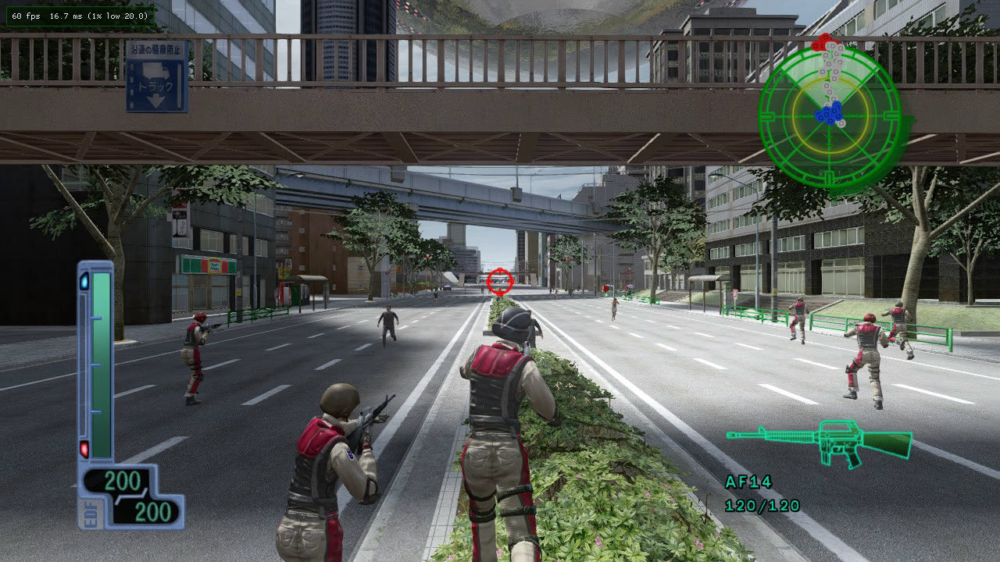
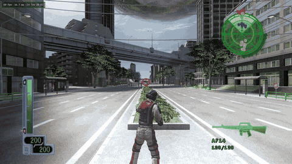
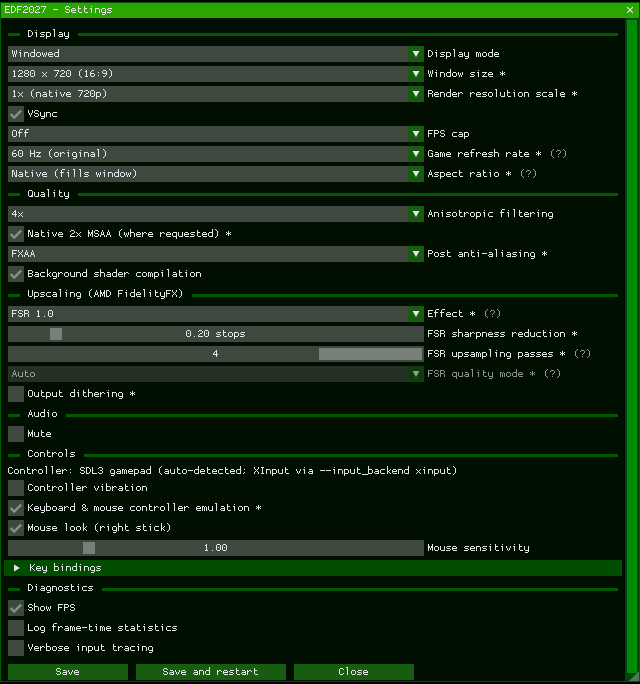
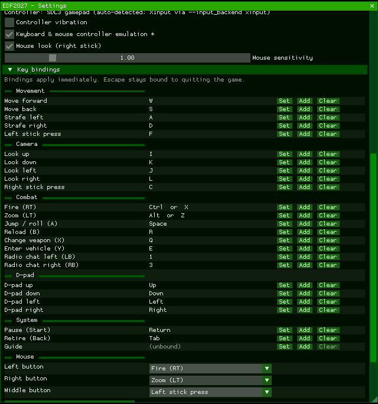
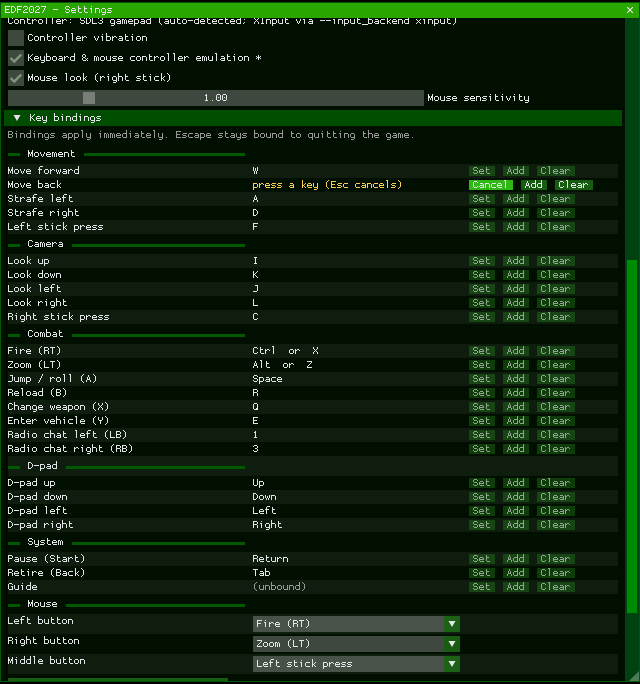
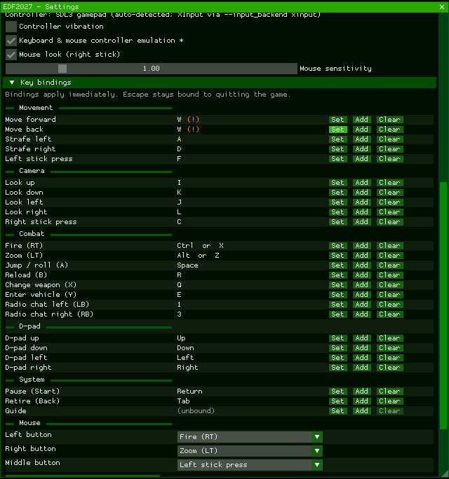

# EDF2027 — Earth Defense Force 2017 PC port (v0.2.0)

A native PC build of the Xbox 360 game *Earth Defense Force 2017* (USA/Europe),
made with static recompilation on the [ReXGlue](https://github.com/rexglue) SDK.

The Windows build defaults to native Direct3D 12 scene rendering and
presentation, including display gamma, SDK overlays, GPU completion, and
profiling. The default path creates no D3D11 device; D3D11 remains an explicit,
delay-loaded fallback. No Xenos GPU plugin is selected or packaged. Full content coverage and handheld performance remain uncertified.
The screenshots and graphics-option descriptions below include the older build.
GPU-plugin quality and upscaling controls are disabled in the native path.
Native VSync uses `edf_native_vsync` independently of the old GPU-plugin setting;
it changes display synchronization, not the fixed 60 Hz simulation clock.
Old build folders may still contain previously copied DLLs; use a fresh output
folder to verify the native distribution. No game data is included.

D3D12 geometry recording defaults to four CPU workers. For comparison,
`--edf_native_geometry_workers=0` uses direct recording and `=1` uses one packet
worker. The [migration notes](docs/native-backend-migration.md) explain ordering,
validation, and measured performance.

Native reads now validate live SDK commitment/protection metadata, with Windows
validation for untracked or unsupported ranges. For diagnostic comparison,
`--edf_native_guest_heap_reads=false` forces the slower Windows-query path.

Native render-state ownership is enabled by default: draw-state words,
scissor-enable and blend-factor colors come from setter-owned CPU snapshots.
`--edf_native_owned_render_state=false` restores the older live state readers
for regression diagnosis; `--edf_native_render_state_audit=true` compares native
state with those readers.

Indexed geometry is no longer re-read and compared on every draw. A model's
vertex and index buffers are snapshotted once, and a later draw reuses that
snapshot whenever the write-tracking registry proves nothing has changed since
it was taken. The comparison is sampled rather than abandoned: the first
`--edf_native_geometry_verify_initial` observations of each buffer and every
`--edf_native_geometry_verify_interval`-th observation afterwards still read and
compare the guest bytes, and a single disagreement permanently restores full
comparison for the rest of the run and logs a warning.
`--edf_native_geometry_verify_interval=0` compares every draw.

The guest's `PA_SU_VTX_CNTL` pixel-centre mode is applied to the game's
full-screen post-processing passes, which is what its downsample chain's
half-texel sampling offsets assume. `--edf_native_pixel_centers=false` restores
the unshifted viewport for regression diagnosis.

Rendering coverage is accounted for rather than assumed: every draw the native
renderer cannot handle is recorded as a distinct *contract* (shaders,
declaration, topology, stride) instead of being silently dropped from the frame,
and reaching the retention limit is counted rather than hiding the rest.
`--edf_native_contract_export=<path>` writes the observed declarations to a
catalog that `edf_native_geometry_check` replays offline against every vertex
shader on the disc. See [docs/native-coverage.md](docs/native-coverage.md).

From a Visual Studio developer shell, `cmake --build <build-dir> --target
audit_native_dependencies` checks the game's transitive non-system PE imports
and rejects Xenos DLLs or dependencies resolved outside the executable folder.
To check a separate staging folder, run `cmake -DEXECUTABLE=<absolute-exe-path>
-P tools/audit-native-dependencies.cmake`. Windows system libraries are treated
as prerequisites; this does not replace runtime testing or detect every dynamic
plugin load.






**This package contains no game data.** You need your own copy of the game
(Xbox 360 disc, dumped as an `.iso`, title id `445007D3`).

The dump this port is developed against:

| | |
|---|---|
| Size | 7,835,492,352 bytes |
| SHA-1 | `3F5DADC9BD11399E3EF260018A058F420EAFB1F6` |

Other dumps of the same release should work — the setup screen checks the title
id in `default.xex`, not the image hash — but this is the one that has been
tested. Verify yours with `Get-FileHash -Algorithm SHA1 <file>.iso` on Windows
or `sha1sum <file>.iso` elsewhere.

## Quick start (Windows)

1. Unzip anywhere, run `edf2027.exe`.
2. On first run the setup screen appears. Click **Select disc image (.iso)…**
   and pick your dump. The game is extracted (about 6 GB) into your user
   folder; a progress bar shows the copy. If you already have the disc
   extracted (a folder containing `default.xex`), use
   **Select extracted game folder…** instead.
3. The game boots straight into the title screen. Press **Start twice** on the
   title (the first press skips the intro).

## OS X

 ... Soon
## Linux 
 ... Soon

## Settings

* **F1** in game — EDF2027 settings: display mode, window size, aspect handling,
  native VSync, experimental frame-rate unlock, FPS cap, audio, controls, and diagnostics.
  **Save** writes them to the config file; items marked `*` need a restart.
  The native renderer currently uses the game's render size. Render-resolution
  scaling and legacy anisotropic-filtering, MSAA, FXAA, background-compilation,
  CAS and FSR controls are disabled. The simulation clock remains 60 Hz.
  Some SDK builds require `amd_fidelityfx_dx12.dll` for loading `rexruntime.dll`;
  its presence does not enable native FidelityFX upscaling.
* **Unlock frame rate (experimental)** — Direct3D 12 can render above 60 FPS
  while simulation stays at 60 Hz. Enable it in F1, then choose a 120 FPS cap
  or Off; VSync also limits presentation to the display refresh. Camera and
  model interpolation add up to one simulation tick of latency. This is opt-in,
  and achievable frame rates depend on scene cost. The Direct3D 11 fallback
  remains limited by its host ticker. See [validation notes](docs/framerate-unlock.md).
* **F2** — toggle the compact FPS overlay.
* **F4** — advanced ReXGlue settings (every runtime option).
* **F3** — debug overlay, **`** — console.
* `edf2027.exe --settings` opens the settings screen before the game boots.



*Historical F1 screenshot from the GPU-plugin build. The native build disables
the legacy quality/upscaling controls described above.*

Config file: `%APPDATA%\edf2027\edf2027.toml` (Windows),
`~/.local/share/edf2027/edf2027.toml` (Linux), `~/Library/Application Support/edf2027/` (macOS).
Extracted game: `<same folder>\game\`. Delete the config file to run setup again.

## Controls

Any gamepad SDL3 recognizes (Xbox, PlayStation, Switch Pro, …) works out of the
box; `gamecontrollerdb.txt` adds community mappings. Prefer XInput with
`--input_backend xinput`.

Keyboard & mouse (enable *Keyboard & mouse controller emulation* in F1 settings):

| Key | Action | Key | Action |
|---|---|---|---|
| W A S D | Move | I J K L | Look (mouse-look fallback) |
| Mouse | Look (right stick) | Arrows | D-pad |
| Left mouse / Ctrl / X | Fire (RT) | Right mouse / Alt / Z | Zoom (LT) |
| Space | Jump / roll (A) | R | Reload (B) |
| Q | Change weapon (X) | E | Enter vehicle (Y) |
| 1 / 3 | Radio chat (LB / RB) | F / C | Stick press (L3 / R3) |
| Enter | Pause (Start) | Tab | Retire (Back) |

Everything above is rebindable in the F1 settings under **Controls → Key
bindings**: *Set* replaces a binding, *Add* gives an action a second key, and
each mouse button can be pointed at any pad action. Bindings apply immediately
and are written to the config file on **Save**. Modifiers are matched exactly,
so a binding of `W` does not fire while Shift is held — bind `Shift+W` for that.
The same settings are also editable as raw `keybind_*` cvars in the F4 overlay.



*Every action, its current keys, and the mouse-button assignments. `Ctrl or X`
means either key works — that is what **Add** creates.*




*Left: pressing **Set** waits for a key, and Escape cancels instead of quitting.
Right: binding a key that another action already uses flags both rows, since
only one of them would respond in game.*

Controller vibration can be enabled or disabled in the F1 settings.
Press **Escape** at any time to quit the game; it cannot be rebound.

## Command line (optional)

```
edf2027.exe [--game_data_root <folder>] [--settings] [--fullscreen=true|false]
            [--window_width N --window_height N] [--draw_resolution_scale_x N --draw_resolution_scale_y N]
            [--edf_native_vsync=true|false] [--edf_fps_cap N] [--audio_mute=true|false] [--log_file run.log]
            [--edf_show_fps=true|false] [--edf_frametime_log=true|false] [--edf_rumble=true|false]
            [--edf_trace_input=true|false] [--edf_frame_pacer_spin_us N]
```
Use `--name=value` for config options on the command line. Boolean options also
accept `--name` (true) or `--no-name` (false). Do not use `--name false`: the
separate word does not disable the flag. Native presentation uses
`edf_native_vsync`, not the legacy GPU-plugin `vsync` option.

For a D3D11 comparison or driver fallback, pass
`--edf_native_scene_backend=d3d11 --edf_native_backend=d3d11`.
Recorded scene draws are enabled by default. To compare the older direct D3D11
path, also pass `--edf_native_seam_draws=false`; direct draws require the D3D11
scene backend. See [the migration status](docs/native-backend-migration.md).

## Troubleshooting

* *"That disc image is not Earth Defense Force 2017"*: the title id in
  `default.xex` did not match `445007D3`; only the USA/Europe release is supported.
* Black window / GPU error: this worktree defaults to native Direct3D 12 on Windows.
  Check the log for native shader, draw or presentation failures. Installing a
  Xenos plugin is not a fix; this port no longer selects one.
* Logs: `--log_file run.log` writes next to the exe.

## Licenses

`LICENSES/` contains the licenses of the bundled components: ReXGlue SDK,
SDL3, Dear ImGui, AMD FidelityFX SDK (MIT), SDL_GameControllerDB (zlib). The port's
own code is provided as-is; the game and its data remain the property of
D3 Publisher / Sandlot.

## Building from source

Requirements: CMake 3.25 or newer, Ninja, Clang, and ReXGlue SDK 0.10.0.
Point `CMAKE_PREFIX_PATH` at an installed SDK (or set `REXSDK_DIR` to an SDK
source checkout), then configure and build:

```powershell
cmake --preset win-amd64-release -DCMAKE_PREFIX_PATH=C:\path\to\rexglue-sdk
cmake --build --preset win-amd64-release
```

The native renderer does not use the SDK's DX12/Vulkan FidelityFX path,
so CAS/FSR controls remain disabled even when those SDK DLLs are available.
Note that `find_package` caches `rexglue_DIR`, so switching a build directory
between SDKs needs its `CMakeCache.txt` deleted first.

On Windows, `build.cmd` performs both steps using the Visual Studio developer
environment. Set `REXGLUE_SDK` first if the SDK is not in the default local
development location. It defaults to two parallel compiler jobs to avoid
exhausting memory on the large generated sources; set `BUILD_JOBS` to override
this. Optional arguments select the preset and target:

```cmd
build.cmd
build.cmd win-amd64-debug edf2027
```

The generated recompilation C++ is tracked. To regenerate it, edit
`edf2017_manifest.toml` so `game_root` and `file_path` point to your own
extracted disc, then build the `edf2017_codegen` target. Game data must never
be committed.

Disc-image extraction is built in (`src/xdvdfs.h` reads the XDVDFS game
partition directly), so a release package needs no external tools:

```powershell
cmake --build out/build/win-amd64-release --target package_release
```

The D3D12 renderer now uses two frame credits by default so CPU preparation can overlap the previous GPU frame. `--edf_native_frame_latency=1` restores the per-frame GPU drain for comparison. The ordered three-surface presentation queue preserves each frame until the host GPU copy completes. A five-minute Mission 1 validation reported 60.0 FPS throughout with zero repeated or skipped images across 17,440 host presentations. A closer-combat run at native 1920x1080 still dipped to 57 FPS, so this is not yet a locked-60 guarantee. Optional display feedback is available through `--edf_native_display_trace=path.csv`. D3D12 VSync off now enables the required variable-refresh flags where supported; VRR also requires monitor/driver configuration. With fixed refresh, a display rate divisible by 60 avoids the uneven refresh spacing of 60 FPS at 165 Hz.
